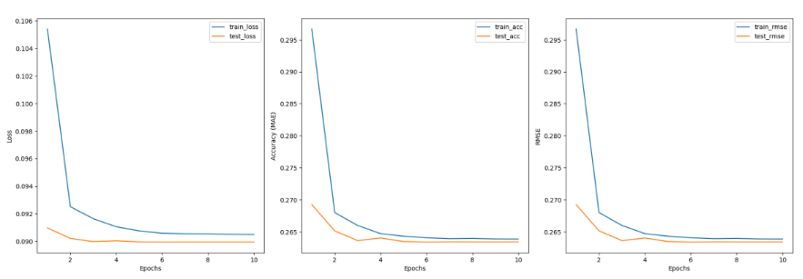

# Deep Learning-Based E-Commerce Product Recommendation

This project implements a **personalized product recommender system** using **Neural Collaborative Filtering (NCF)**. Built with PyTorch and deployed via Gradio, it predicts and visualizes the top-k product recommendations for users using the **Amazon Reviews 2023 dataset**.

---

## Objective

Build an efficient recommendation engine that:
- Learns from user-product interaction history
- Predicts next likely purchases (top-N recommendations)
- Delivers high accuracy while minimizing latency

---

## Final Performance (After Fine-Tuning)

| Metric   | Value     |
|----------|-----------|
| Loss     | 0.0900    |
| MAE      | 0.2636    |
| RMSE     | 0.2636    |
| Latency  | 0.14 ms   |
| Speedup  | 1.54× over original |

✅ Dropout, embedding size reduction, and learning rate scheduling improved generalization and inference speed.

---

## Tech Stack

- **Frameworks:** PyTorch, Gradio
- **Dataset:** Amazon Reviews 2023 + Metadata
- **Optimization:** TorchScript, parallel DataLoader, batch inference

---

## Sample Output

### Bought Items

### Recommended Items

